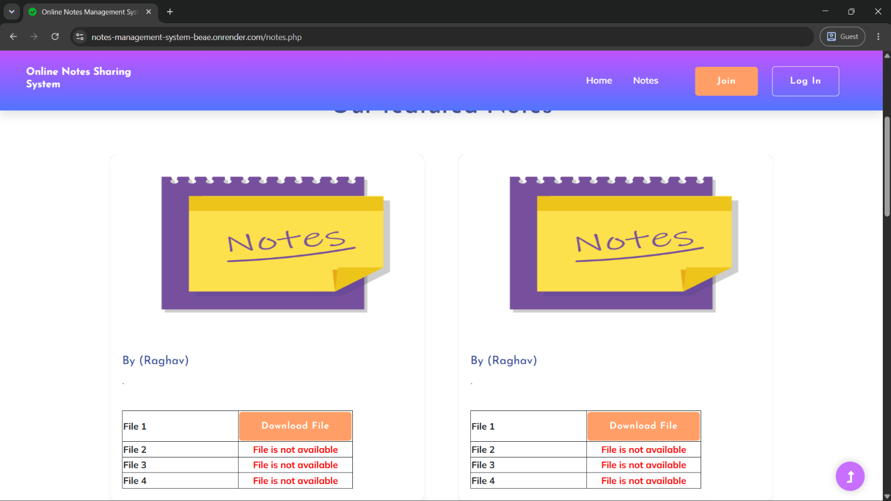
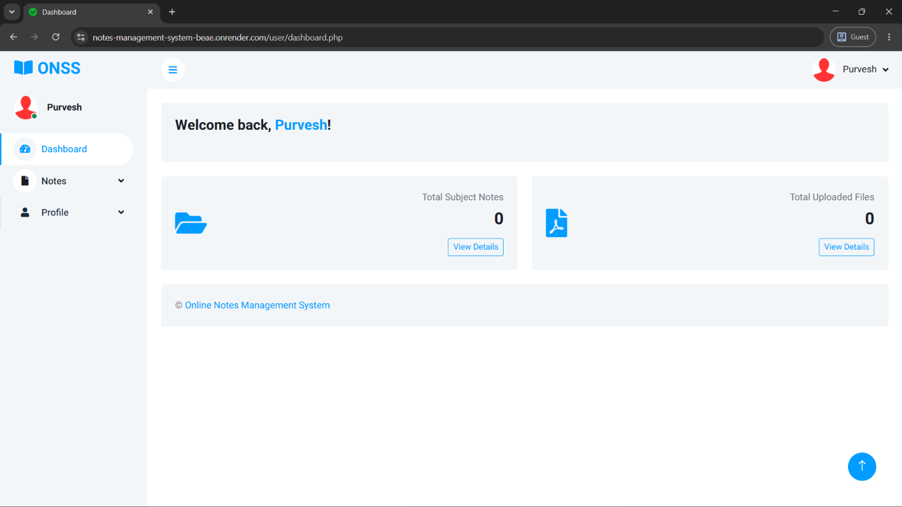
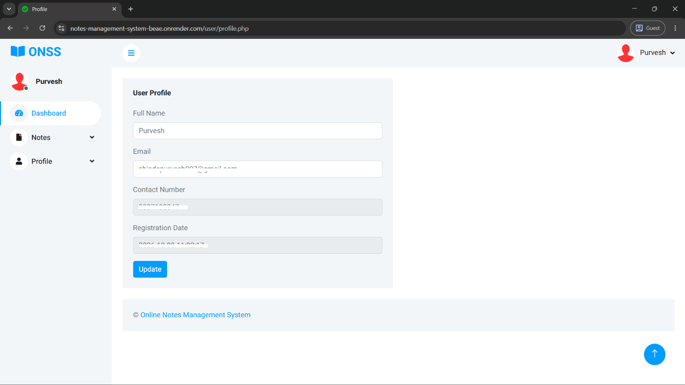
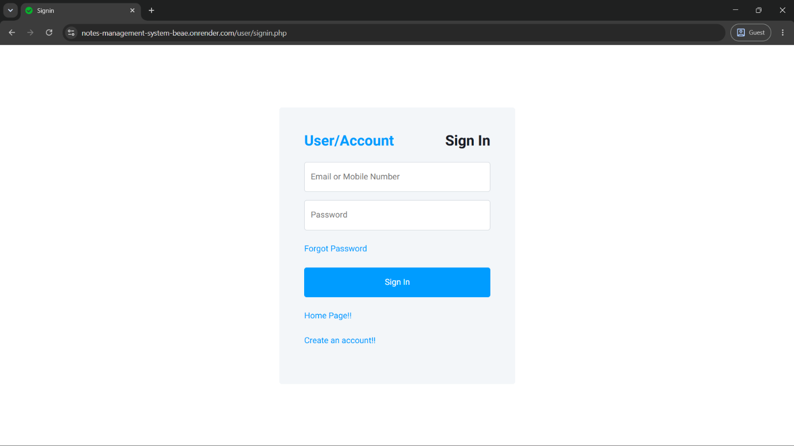
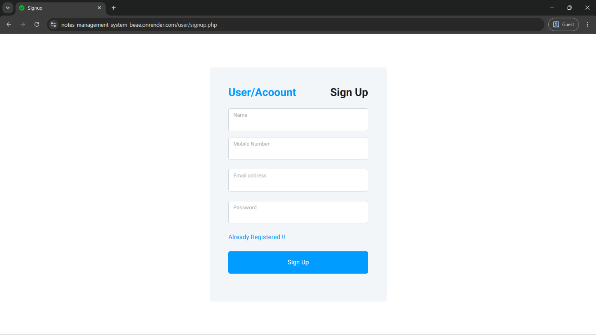

<div align="center">
  
# 📝 Notes Management System

[](https://php.net/)
[](https://www.mysql.com/)
[](https://getbootstrap.com/)
[](https://opensource.org/licenses/MIT)
[](#)

**A simple, intuitive, web-based platform to create, manage, and organize personal notes.**

<br/>
<a href="https://notes-management-system-beae.onrender.com/">
  
</a>
</div>

---

## 📑 Table of Contents

- [Features](#-features)
- [Tech Stack](#-tech-stack)
- [Prerequisites](#-prerequisites)
- [Getting Started](#-getting-started)
- [Contributors](#-contributors)
- [License](#-license)
- [Contact](#-contact)

---

## 📸 Screenshots

| Homepage | Notes Feed |
| :---: | :---: |
|  |  |

| Dashboard Panel | User Profile |
| :---: | :---: |
|  |  |

| Sign In | Sign Up |
| :---: | :---: |
|  |  |

---

## ✨ Features

- **User Authentication:** Secure Registration, Login, and Password Recovery.
- **Notes Management:** Create, Read, Update, Delete (CRUD) operations for notes.
- **File Attachments:** Upload up to 4 files (images, documents, etc.) per note.
- **Note History Tracking:** Keep track of your note updates.
- **Profile Management:** Manage user profiles and change passwords.
- **Responsive UI:** Built with Bootstrap to work flawlessly across devices.

---

## 💻 Tech Stack

- **Backend:** PHP (7.x or 8.x)
- **Database:** MySQL / MariaDB
- **Frontend:** HTML5, CSS3, JavaScript, jQuery, Bootstrap
- **Icons:** FontAwesome, Themify Icons, Flaticon

---

## 🛠️ Prerequisites

To run this project, you will need:
- Local development server like **XAMPP, WAMP, or LAMP**
- PHP enabled (version 7.0+)
- MySQL or MariaDB
- Web browser (Chrome, Firefox, Edge, etc.)

---

## 🚀 Getting Started

Follow these steps to run the project locally:

### 1. Clone the Repository

```bash
git clone https://github.com/PurveshShinde/Notes_Management_System.git
```

### 2. Setup the Database

- Open **phpMyAdmin** (e.g., `http://localhost/phpmyadmin/`).
- Create a new database named `notes`.
- Import the `database/notes.sql` file provided in the project folder into the newly created database.

### 3. Configure Database Connection

Open `user/includes/dbconnection.php` and verify/update your database credentials if necessary:

```php
define('DB_SERVER','localhost');
define('DB_USER','root'); // Your DB Username
define('DB_PASS' ,'');    // Your DB Password
define('DB_NAME', 'notes'); // Your DB Name
```

### 4. Run the Project

- Move the project folder to your server root (e.g., `htdocs` for XAMPP or `www` for WAMP).
- Visit `http://localhost/Notes_Management_System/` in your browser.

---

## 👥 Contributors

- **Purvesh Shinde** - [GitHub](https://github.com/PurveshShinde)
- **Amey Gawade** - [GitHub](https://github.com/ameyg11)
- **Prathamesh Ambekar** - [GitHub](https://github.com/PrathameshAmbekar15)

Thanks to all the contributors who have helped improve the **Notes Management System**! 

<div align="left">
  <a href="https://github.com/PurveshShinde">
    
  </a>
  <a href="https://github.com/ameyg11">
    
  </a>
  <a href="https://github.com/PrathameshAmbekar15">
    
  </a>
</div>

> **Note:** This project is currently completed and closed for new contributions. Feel free to fork it and use it as a starting point for your own projects!

---

## 📄 License

This project is licensed under the [MIT License](LICENSE) - see the LICENSE file for details.

---

## 📬 Contact

- **Author:** Purvesh Shinde
- **Email:** shindepurvesh007@gmail.com
- **GitHub:** [PurveshShinde](https://github.com/PurveshShinde)
